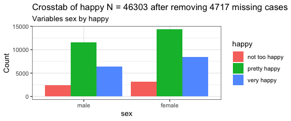

```{r setup, include=FALSE}
knitr::opts_chunk$set(echo = TRUE)
```

### 윤석열 대통령 국정 운영 평가

QA01. 귀하께서는 윤석열 대통령이 국정운영을 얼마나 잘하고 있다고, 혹은 잘못하고 있다고 생각하십니까?

| 잘함 | 잘못함 | 잘모름(%) |
|:----:|:------:|:---------:|
| 28.2 |  67.8  |    4.0    |

| 매우 잘함 | 어느정도 잘함 | 어느정도 잘못함 | 매우잘못함 | 잘모름(%) |
|:---------:|:-------------:|:---------------:|:----------:|:---------:|
|    8.4    |     19.7      |      17.9       |    49.9    |    4.0    |

```{r cars}
summary(cars)
```

### Including Plots

You can also embed plots, for example:



```{r pressure, echo=FALSE}
plot(pressure)
```

Note that the `echo = FALSE` parameter was added to the code chunk to prevent printing of the R code that generated the plot.

### 두번째 (핵심) 질문 (목록)

잘못함을 구성하는 하위 항목들의 순서와 비율을 보입니다.
